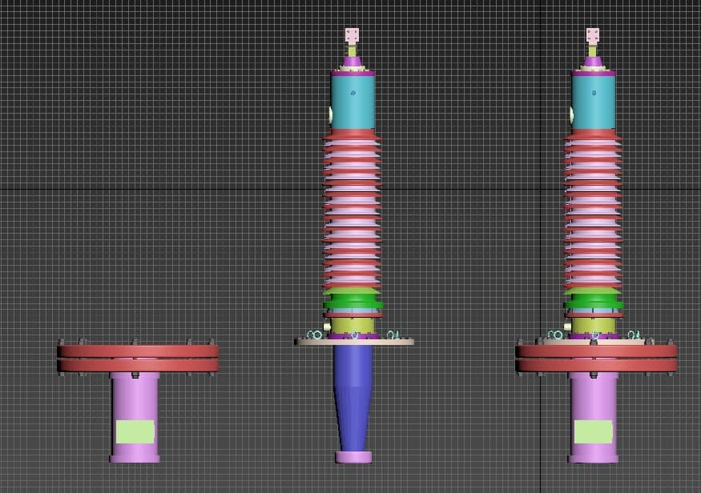
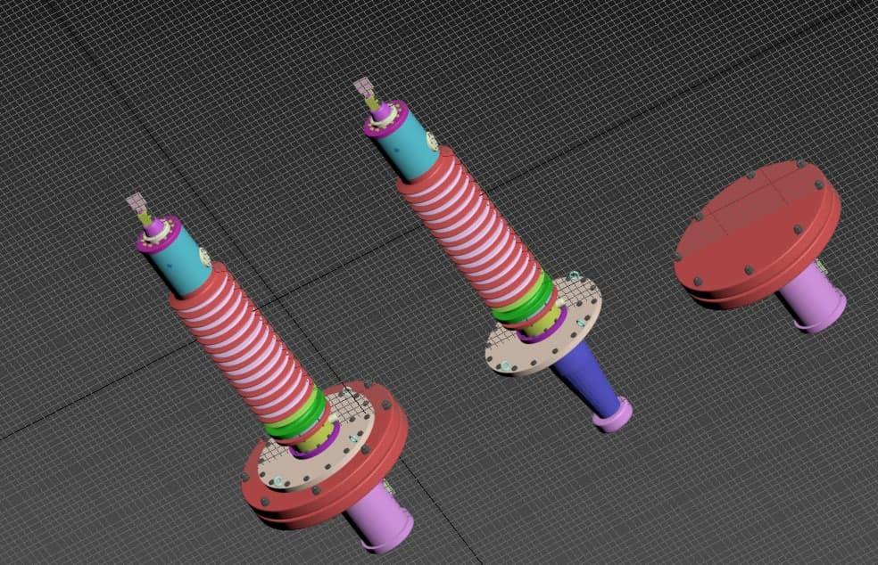
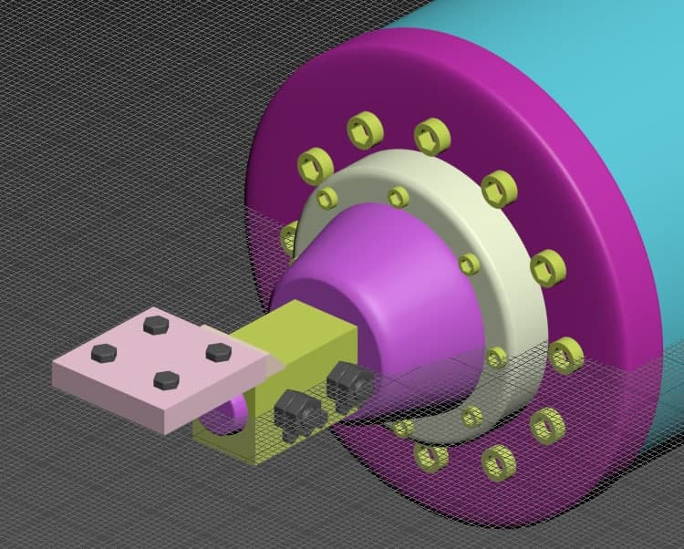
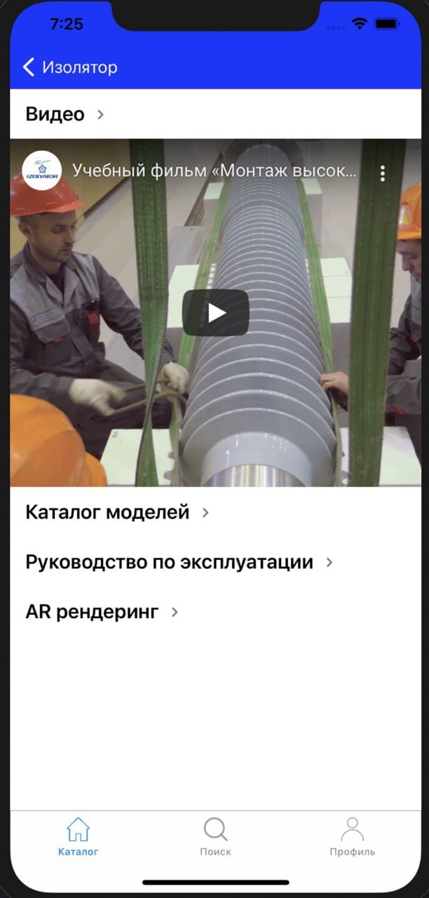

# Izolytor 

Данное мобильное приложения создано в качестве демонстрационного проекта.
Мобильное приложение Izolytor предоставлеяет следующие возможности: 
  - Отобразить информацию по каждому типу высоковольтного ввода 
  - Отобразить 3D модель высоковольтного ввода в AR пространстве 
  - Осуществить загрузку и воспроизведение видеоматериалов по монтажу и установке технического изделия
  - Отобразить каталог вводов в соответствии с типом крепления для установки ввода 
  - Предоставить руководство по эксплуатации
  - Предоставить возможность загрузки чертежа выбранного ввода

## Оглавление
1. [Что такое высоковольтный ввод ?](#Что-такое-высоковольтный-ввод-?)
2. [3D модель](#3D-модель)
3. [Интерфейс приложения](#Интерфейс-приложения)
   - [Главный экран](#Главный-экран)
   - [Экран монтажа](#Экран-монтажа)
   - [Экран отображения PDF документов](#Экран-отображения-PDF-документов)
   - [Экран поиска ](#Экран-поиска)
   - [Экран отображения 3D модели в Ar сцене](#Экран-отображения-3D-модели-в-Ar-сцене)
4. [Архитектура приложения](#Архитектура-приложения)
5. [Хранение данных](#Хранение-данных)
6. [UI](#UI)
7. [Работа с сетью](#Работа-с-сетью)

# Что такое высоковольтный ввод ?

Высоковольтный ввод – один из важнейших элементов в контуре «электростанция – линия электропередачи – трансформаторная подстанция». От качества ввода, его эксплуатационных свойств зависит работоспособность всей энергетической системы и стабильное обеспечение потребителей электроэнергией.

# 3D модель

Для отображения высоковольтного ввода в Ar простарнстве была разработана 3D модель технического устройства. 
В качестве фреймворка для работы с дополненной реальностью использовался ArKit. 

Ниже представлены изображения составных частей 3D модели. 

| Составные части высоковольтного ввода в 2D | Составные части высоковольтного ввода в 3D | Составные части крепления    |
| --------------------------- | --------------------------- | ---------------------------- |
|  |  |  |

Итоговый результат рендеринга 3D модели в программе Blender: 

# Интерфейс приложения 

Ниже представлены основные экраны приложения 

## Главный экран

На данном экране пользователю доступны следующие функции:
- Выбрать тип высоковольтного ввода в "карусели" продуктов
- Посмотреть название и краткую информацию о выбранном типе ввода
- Перейти на страницу монтажа 
- Открыть Ar сцену с выбранным высоковольтным вводом

## Экран монтажа    

Данный экран состоит из 4-рех секций: 
  - 1. Секция видео материалов
  - 2. Сварачивающаяся ячейка с каталогом
  - 3. Сварачивающаяся ячейка с руководством
  - 4. Сварачивающаяся ячейка с переходом на экран Ar сцены 

| Развернутые ячейки | Свернутые ячейки |
| --------------------------- | --------------------------- |
|  | 

На данном экране присутствуют следующие возможности: 
  - Загрузка видео материала по установке и вводу в эксплуатацию выбранного на главном экране устройства 
  - Отображение списка "Каталога" всех вводов соотвествующие выбранному типу высоковольтного ввода
  - Отображение pdf документа "Руководство по эксплуатации"
  - Открытие Ar сцены с выбранным высоковольтным вводом

## Экран отображения PDF документов 

На данном экране присутствуют следующие возможности: 
  - Отображение pdf документов 
  - Пересылка документа в мессенджеры установленные на устройстве (telegram, watsapp, ....) 

| PDF документ | Sharing документа |
| --------------------------- | --------------------------- |
|   | 

## Экран поиска 

На данном экране присутствуют следующие возможности: 
  - Просмотр всех существующих в базе данных высоковольтных вводов
  - Выбрать интересующий ввод и просмотреть чертеж выбранного из списка ввода
  - Возможность использовать поиск для удобстава поиска ( Поиск происзодит по: названию, маркировке) 

## Экран отображения 3D модели в Ar сцене

На данном экране присутствуют следующие возможности: 
  - Прилижение и отдаление 3D модели
  - Разворот модели на 360 градусов вокруг своей оси (X, Y, Z) 
  - Перемещение модели по касанию на экран

# Архитектура приложения 

- VIPER 

# Хранение данных 

- Для сохранения информации о высоковольтных вводах использовался FireBase 
- И локальное кеширование 

# UI 

- Интерфейс приложения реализован программно без использования storyboard и xib файлов 
- В качестве UI фреймворка использовался UIKit 

# Работа с сетью 

- Для работы с сетью использовалась URLSession 

